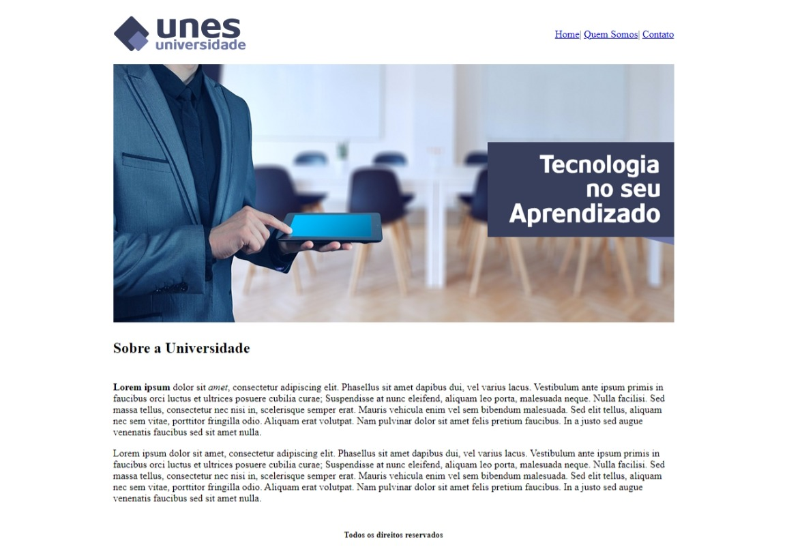
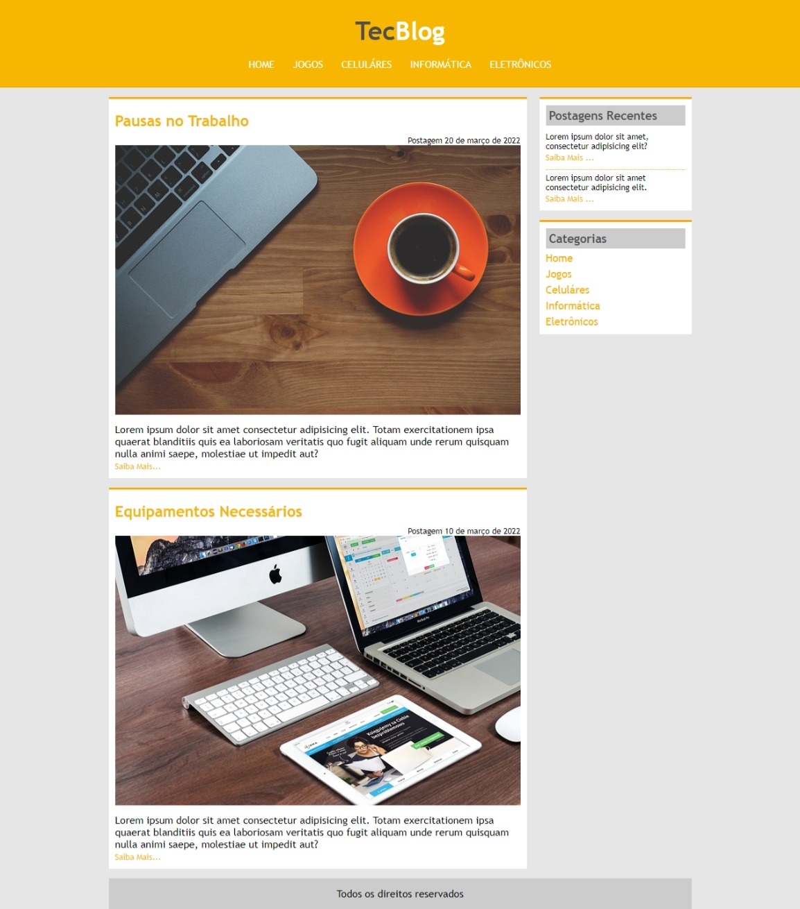

# Pojetos_Udemy_Desenvolvimento_Web
### Sobre o curso
Desenvolvimento Web Completo 2022 - 20 cursos + 20 projetos HTML5, CSS3, SASS, Bootstrap, JS, ES6, PHP 7, OO, MySQL, JQuery, MVC, APIs, IONIC e muito mais
---

* Projeto-01- Site Faculdade UNES 

* Projeto-02- Site Anna Bella
* Projeto-03 - Site TecBlog

